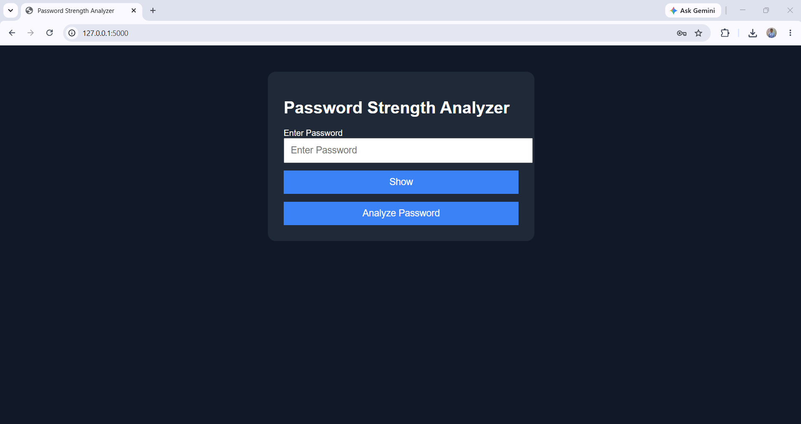

# 🔐 Password Strength Analyzer

A Flask-based web application that analyzes password strength based on security best practices. The application evaluates passwords using multiple criteria, provides improvement suggestions, generates secure passwords, and prevents password reuse using bcrypt hashing with SQLite.

---

## 📸 Project Screenshot



---

## 🚀 Features

- ✅ Password Length Validation
- ✅ Uppercase Letter Detection
- ✅ Lowercase Letter Detection
- ✅ Number Detection
- ✅ Special Character Detection
- ✅ Password Strength Score
- ✅ Strength Classification
- ✅ Password Improvement Suggestions
- ✅ Strong Password Generator
- ✅ Password Reuse Detection
- ✅ Secure Password Storage using bcrypt
- ✅ SQLite Database Integration
- ✅ Show / Hide Password
- ✅ Copy Generated Password

---

## 🛠 Technologies Used

- Python
- Flask
- SQLite
- bcrypt
- HTML5
- CSS3
- JavaScript

---

## 📂 Project Structure

```text
PasswordStrengthAnalyzer/
│
├── app.py
├── analyzer.py
├── generator.py
├── database.py
├── common_passwords.txt
├── requirements.txt
├── README.md
│
├── assets/
│   ├── style.css
│   ├── script.js
│   └── images/
│
├── templates/
│   └── index.html
│
├── database/
│   └── passwords.db
│
└── screenshots/
    └── homepage.png
```

---

## ⚙ Installation

Clone the repository

```bash
git clone https://github.com/nalawadeshravani202/Password-Strength-Analyzer.git
```

Go into the project folder

```bash
cd Password-Strength-Analyzer
```

Create a virtual environment

```bash
python -m venv venv
```

Activate the virtual environment

Windows

```bash
venv\Scripts\activate
```

Install dependencies

```bash
pip install -r requirements.txt
```

Run the project

```bash
python app.py
```

Open in browser

```
http://127.0.0.1:5000
```

---

## 🔒 Password Evaluation Criteria

| Criteria | Score |
|----------|------:|
| Length ≥ 8 | 20 |
| Uppercase Letter | 15 |
| Lowercase Letter | 15 |
| Number | 15 |
| Special Character | 20 |
| Not Common Password | 10 |
| No Repeated Characters | 5 |

---

## 📊 Password Strength Levels

| Score | Strength |
|-------:|----------|
| 0–39 | Weak |
| 40–69 | Medium |
| 70–89 | Strong |
| 90–100 | Very Strong |

---

## 💡 Future Enhancements

- Password Entropy Calculation
- Password Breach Check API
- Dark Mode
- Live Password Analysis
- Password History Dashboard
- Export Report as PDF
- Multi-language Support

---

## 👩‍💻 Author

**Shravani Nalawade**

- GitHub: https://github.com/nalawadeshravani202
- LinkedIn: https://www.linkedin.com/in/shravani-sachin-nalawade-795b24322/

---

## ⭐ If you found this project useful, consider giving it a star.